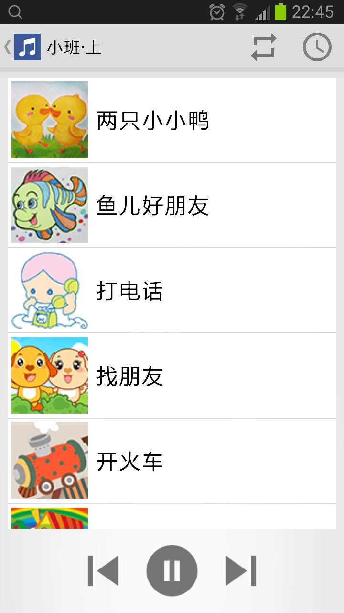
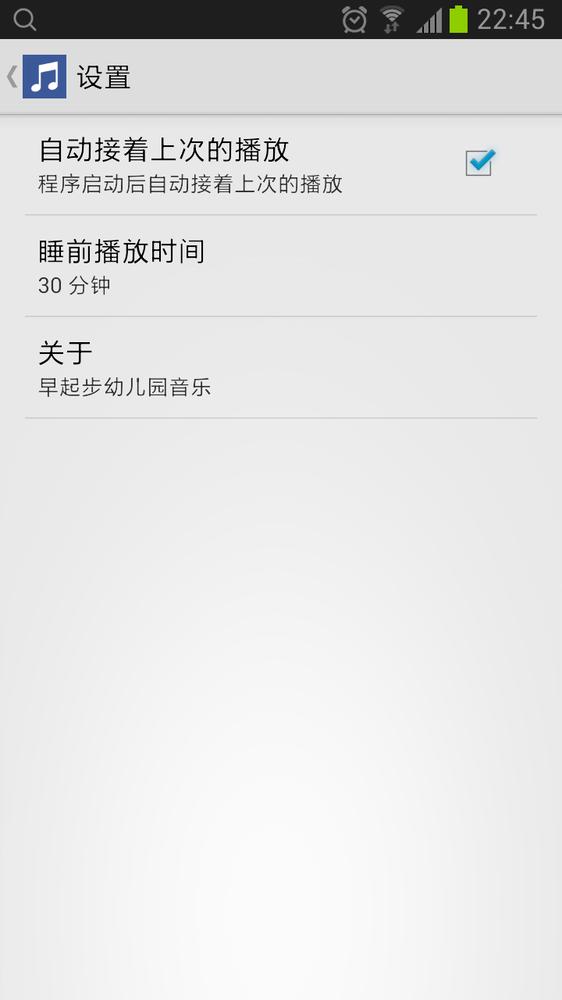
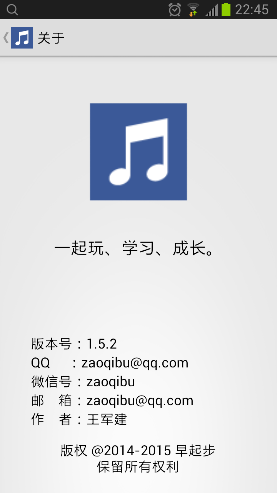

# 幼儿园音乐

## 介绍
幼儿园音乐--幼儿园音乐的目标是给幼儿园的小朋友提供适合自己操作的音乐播放器。幼儿园的小朋友根据自己上的大、中、小班来选择，默认是所有的歌循环播放，也可以选择单首歌循环播放，还可以睡前播放。幼儿园音乐内容来源于《山东省幼儿园课程指导》的音乐CD。

## 功能
* 通过图片选择歌曲。
* 选择了所属班级会自动播放上一次退出时播放的歌。
* 对于喜欢的歌曲，可以选择单首歌循环播放。
* 当前播放的音乐自动显示在可视窗口中。
* 设置睡前播放的时间，时间到了自动暂停播放。
* 设置启动后自动接着上次的播放。

## 截图

